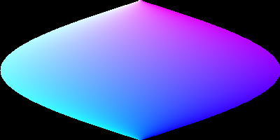
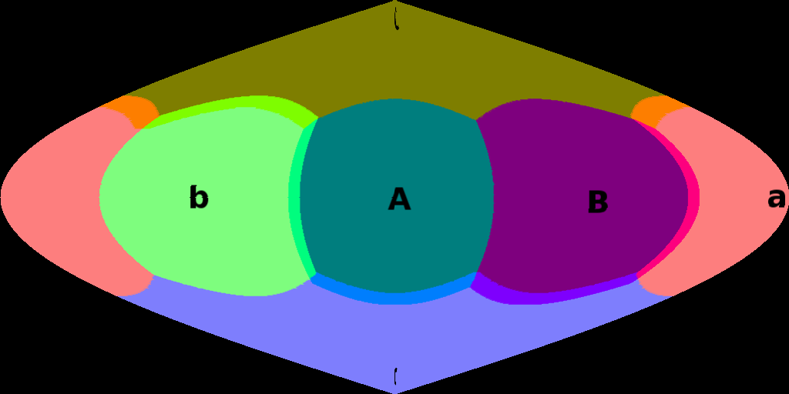

# EquirectAdaptiveKernel

SphereNet(ECCV2018)을 구현한 ChiWeiHsiao의 [SphereNet-pytorch](https://github.com/ChiWeiHsiao/SphereNet-pytorch)에 적용할 수 있는 새로운 형태의 Omni-Kernel이다.

2021년 2월에 개발하였다.

- Omni-MNIST에 대한 것은 ChiWeiHsiao가 구현한 것을 그대로 따른다.
- `SphereNet`에 대한 부분은 삭제하였다.
- 마찬가지로 `Conventional CNN`에 대한 부분도 삭제하였다.

## Evaluation

| Method        | Test Acc (%) |
| ------------- |:--------------:|
| SphereNet ( ChiWeiHsiao ) | 94% |
| SphereNet ( our ) | 94% |
| AdpativeNet ( our; 5x5 ) | 94% |
| AdpativeNet ( our; 3x3 ) | 91% |
| EquirectCNN ( ChiWeiHsiao / our )| 91% |

## Detail

1\. `F.grid_sample()` 옵션

``` python
x = F.grid_sample(x, grid, align_corners=True, mode='bilinear')
```

`torch`의 `F.grid_sample()`에는 여러 옵션을 줄 수 있다. 
그런데 실험 결과 어떤 옵션을 주는지에 따라서, Acc 결과값이 달라졌다. 
몇몇의 실험을 거친 결과 위와 같은 옵션으로 돌릴 때, `SphereCNN`과 동일한 94%의 ACC를 보였다.


2\. `CNN` 구성

`SphereNet` 논문을 보면, 5x5 conv를 사용했음을 볼 수 있다. 
ChiWeiHsiao의 코드는 구현 상의 문제로 3x3 conv를 사용했으나 본인의 경우 일반적인 nxm kernel을 사용할 수 있으므로 5x5 conv를 사용하도록 했다.
(3x3 conv를 사용할 경우 91% ACC가 나와서 `Conventional CNN`과 동일한 ACC를 보이지만, 5x5 conv를 사용하면 `SphereCNN`과 동일한 94% ACC를 보인다.)

3\. `np.round()` 제거 & 완전한 mollweide

기존에 `utils.py`의 `next_steps = np.round(next_steps * width)` 부분의 `np.round()`를 제거한 결과 보다 매끄럽고 완전한 형태의 mollweide 이미지를 얻을 수 있었다.

그외에 `Equirect2Adaptive.py`의 `generateGrid()`에서 조건식이 하나 추가되었지만, discretization 과는 별개의 작업이다.






